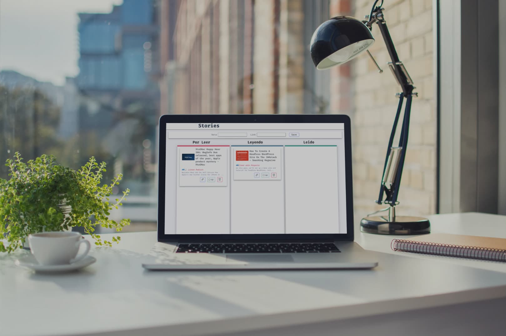

<!-- AUTO-GENERATED-CONTENT:START (STARTER) -->
<p align="center">
  <a href="https://www.gatsbyjs.com">
    
  </a>
</p>
<h1 align="center">
 Stories: Personal Project
</h1>
<div align="center">
  <h3>
    <a href="https://stories-box.netlify.app/">
      Demo
    </a>
    <span> | </span>
    <a href="http://alexbaez.dev/projects/stories-box">
      Info
    </a>
  </h3>
  <p>Guarda enlaces de artículos, post de interés y captura una pequeña nota 📝 , para recordar el porque lo deseas leer y tener una vista previa del enlace.</p>
</div>



### Stack

- React
- Gatsby
- Netlify Functions
- Fauna
- Auth0

## Features

- Kanban Board
- User account

### 🚀 Instructions for to operate project on your local machine

1.  **Clone this repository.**

    ```shell
    git clone https://github.com/alexbaezd/stories-box.git
    ```

2.  **Create a .env.development file**

    - Create an application on [Auth0](https://auth0.com) and config Allowed Callback URLs,Allowed Logout URLs,Allowed Web Origins with http://localhost:8888.

    - Create a database on [Fauna](https://fauna.com) and upload stories.gql file

    ```shell
      GATSBY_AUTH0_DOMAIN=your-domain.auth0.com
      GATSBY_AUTH0_CLIENT_ID=your-client-id
      FAUNA_SERVER_SECRET=your-apikey
      GATSBY_URL_FUNCTIONS=https://localhost:8888/.netlify/functions
    ```

3.  **Start developing.**

    Navigate into your new site’s directory and start it up.

    [Netlify-CLI](https://docs.netlify.com/cli/get-started/#installation)

    ```shell
    ntl dev
    ```
